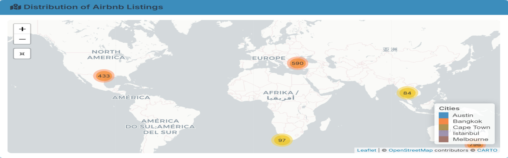

<div class="blog-banner">
  
</div>

# Building an Interactive Travel Dashboard with R Shiny

How I turned raw Airbnb data from six cities into a live, interactive dashboard anyone can use to plan a trip.

## What Is R Shiny and Why Should You Care?

Before getting into what I built, let me explain the tool behind it in plain terms.

R is a programming language mostly used for data analysis and statistics. Shiny is a package that sits on top of R and does something pretty remarkable. It lets you turn your data analysis into a live, interactive web app without needing to know any web development. No HTML, no JavaScript, no backend servers to configure. You write R code and Shiny handles the rest.

Think of it like this: imagine you built a really detailed spreadsheet that updates automatically when you change a filter. Shiny is that, but as a proper web app that anyone with a link can use.

A basic Shiny app has just two parts:

```r
# The ui controls what the user sees
ui <- fluidPage(
  selectInput("city", "Choose a city:", choices = c("Austin", "Bangkok")),
  plotOutput("price_chart")
)

# The server controls what happens behind the scenes
server <- function(input, output) {
  output$price_chart <- renderPlot({
    # your chart code goes here
  })
}

shinyApp(ui, server)
```

That is the whole skeleton. Everything else builds on top of it.

## The Problem I Wanted to Solve

Planning international travel involves a lot of guesswork. You might find an Airbnb price for Bangkok, but how does that compare to Melbourne? And what does your total daily budget look like when you add food and local expenses on top of accommodation?

I wanted one place where a traveler could compare all of that across multiple cities, filtered by their budget and preferences, without opening five different tabs and doing math in their head.

## What the Dashboard Does

The dashboard pulls together Airbnb listing data from six cities: Austin, Bangkok, Buenos Aires, Cape Town, Istanbul, and Melbourne, combined with cost of living data from Numbeo. Here is what you can actually do with it:

Filter by city, room type, price range, and number of reviews and every chart on the page updates instantly. You can see listings on an interactive map, click a marker, and get the price, neighborhood, and availability for that specific listing. You can compare average nightly rates across cities and room types side by side, calculate a total trip cost for a 3, 5, or 7 day stay including both accommodation and daily living expenses, and spot the best value cities using a price per review ratio where lower means more people are paying less and still leaving good reviews.

## One Thing That Surprised Me

The biggest surprise was how much availability varies by city. Some cities had listings open for most of the year while others were barely available. That is something you would never notice just browsing Airbnb normally, but it jumps out immediately on the heatmap.

The other surprise was how affordable some cities look on a per-night basis until you factor in daily living costs. The dashboard makes that gap visible in a way that a simple price search never does.

## Try It Yourself

The dashboard is live and free to use. No login, no signup, just click and explore.

🔗 [Open the Live Dashboard](https://kduffuor.shinyapps.io/airbnb-tourist-analytics-dashboard/)

The full code is also open on GitHub if you want to explore how it was built or adapt it for your own cities.

🔗 [View on GitHub](https://github.com/kduffuor/Airbnb-Tourist-Dashboard)

## What I Took Away From This

Shiny closes a gap that most data tools leave open, the gap between analysis and communication. You can do the most thorough analysis in the world, but if the person who needs the insight has to read a static report to get it, something is lost. Shiny lets the data speak for itself, interactively, to anyone.

If you work with data and have never tried Shiny, this is a good first project to attempt. Start with one dataset, one chart, and one filter. The rest builds naturally from there.

---

*Built with R, Shiny, Leaflet, Plotly, and Tidyverse. Data sourced from public Airbnb listings and Numbeo.*