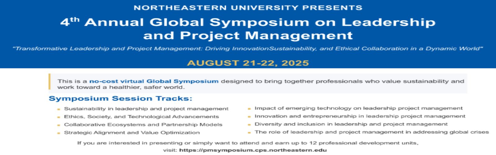

  

# Behind the Scenes: My Journey as a Digital Alchemist at Northeastern University's Global Symposium

When I first received the opportunity to serve as one of the organizers for the [2025 Northeastern University Global Symposium on Leadership & Project Management](https://pmsymposium.cps.northeastern.edu/basic-page/), I had no idea how much I would take away from it. What started as an invitation to contribute to a prestigious academic gathering turned into a masterclass in collaboration, digital strategy, and the art of bringing together brilliant minds from around the world.

## The Magic Behind the Curtain

My role on the organizing team encompassed far more than I initially anticipated. From crafting email campaigns for participants to managing social media announcements for our spotlight speakers, every day brought new challenges and fresh lessons. Academic event management turned out to be a fascinating blend of strategic communication, technical coordination, and relationship building.

The symposium, scheduled for August 21-22, 2025, brought together thought leaders, industry experts, and scholars dedicated to advancing leadership and project management. Being part of the team that made that vision a reality was both humbling and rewarding.

## A Pivotal Connection

None of this would have been possible without the support of **Dr. Behnaz Merikhi**, whose belief in my potential opened doors I never imagined. Dr. Merikhi is an Assistant Teaching Professor in the Master of Professional Studies in Informatics program at Northeastern University, Toronto, with a PhD in Electrical and Computer Engineering from Concordia University. Her academic excellence is matched only by her generous mentorship.

She did not just provide an opportunity; she created a bridge to Northeastern's faculty network. Her guidance throughout this journey has been invaluable, and I am deeply grateful for her faith in my ability to contribute meaningfully to such a significant event. You can learn more about her work through her [Northeastern University faculty profile](https://cps.northeastern.edu/faculty/behnaz-merikhi/).

## Lessons in Collaboration

Working alongside Northeastern's faculty taught me that academic excellence thrives on genuine collaboration. Each email strategy session, each social media campaign, and each coordination meeting revealed the careful planning and dedication that go into producing a world-class symposium. The faculty members I worked with demonstrated not only deep expertise in leadership and project management but also a real commitment to developing the next generation of professionals.

Managing participant communications also taught me the balance between professionalism and warmth that academic outreach requires. Every message we sent was not just information; it was an invitation to be part of something larger, a global conversation about the future of leadership and project management.

## Digital Alchemy in Action

The title "digital alchemist" became a fitting metaphor for what we accomplished together. Like alchemists who sought to transform raw materials into something valuable, our team took ideas, schedules, speaker profiles, and logistical details and shaped them into engaging content that drew participants from around the world. Whether it was writing the right subject line for a participant email or timing a social media post for maximum reach, every digital touchpoint mattered.

The spotlight speaker announcements were particularly rewarding to manage. Watching the excitement build across platforms as we revealed each speaker was a good reminder of how much strategic communication can do in an academic setting.

## Reflecting on Success

The symposium has concluded, and it was an extraordinary gathering. Watching months of planning come together was deeply satisfying. The experience has been more than educational; it has been transformational. Working with Northeastern's faculty, collaborating with fellow organizers, and contributing to an event that reached leaders and project managers globally is something I will carry with me throughout my career.

To everyone who joined us for the [2025 Global Symposium on Leadership & Project Management](https://pmsymposium.cps.northeastern.edu/), thank you for validating the work our team poured into creating an experience worthy of your time and expertise.

## A Note of Gratitude

This journey reinforced something I deeply believe: the most meaningful professional experiences come from the relationships we build and the mentors who see potential in us. Dr. Behnaz Merikhi's support exemplifies the best kind of academic mentorship, generous, visionary, and genuinely committed to student success.

To my fellow organizers, the faculty who welcomed me into their planning processes, and the participants who made the symposium a success: thank you for letting me be part of something truly special.

---

*The 2025 Northeastern University Global Symposium on Leadership & Project Management took place on August 21-22, 2025. For more information, visit [pmsymposium.cps.northeastern.edu](https://pmsymposium.cps.northeastern.edu/). You can also view my profile at the symposium website [pmsymposium.cps.northeastern.edu/kwabena-asante](https://pmsymposium.cps.northeastern.edu/kwabena-asante)*