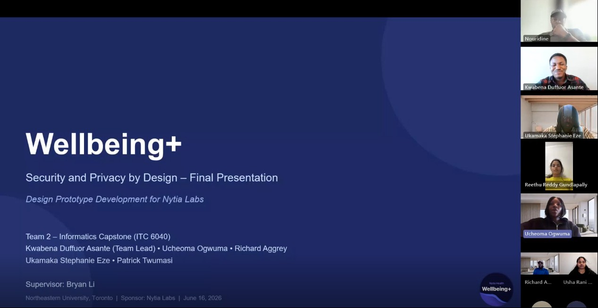
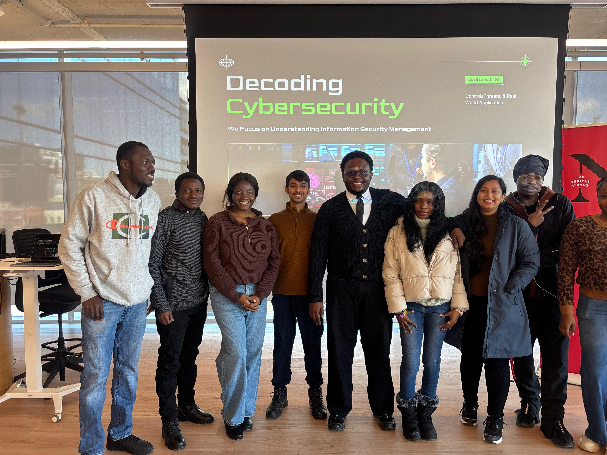
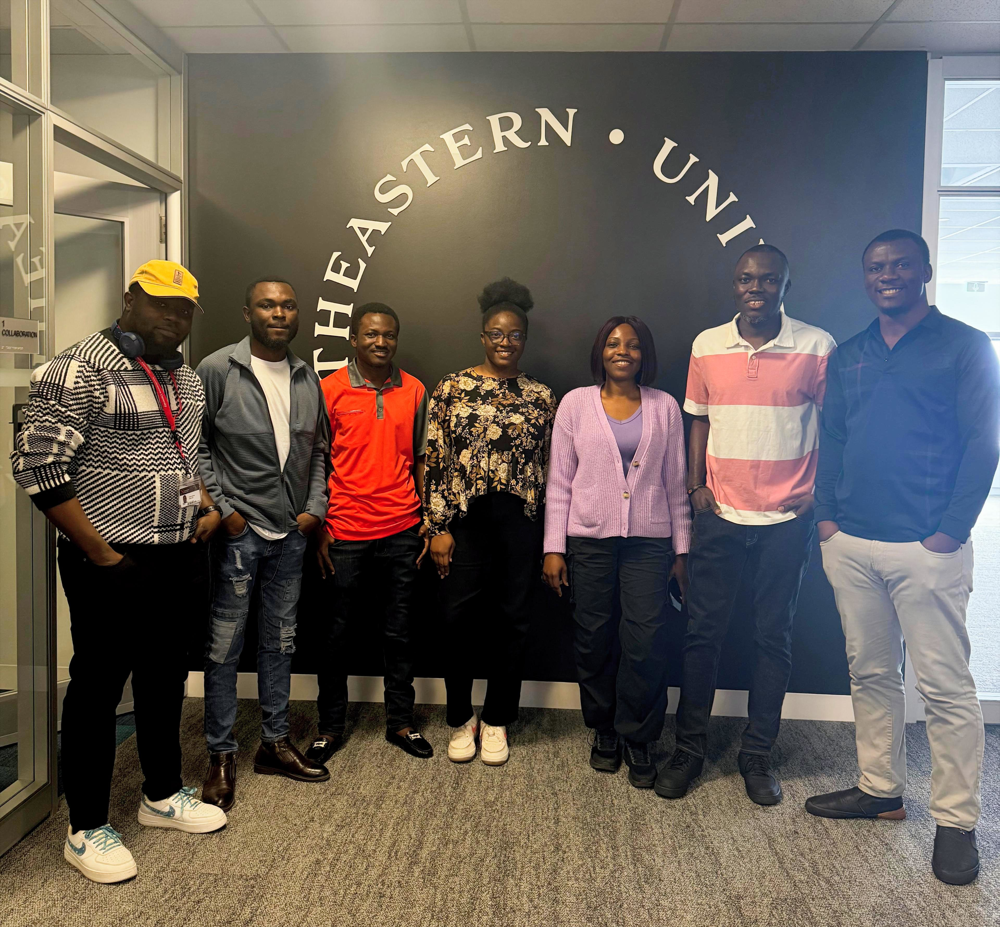
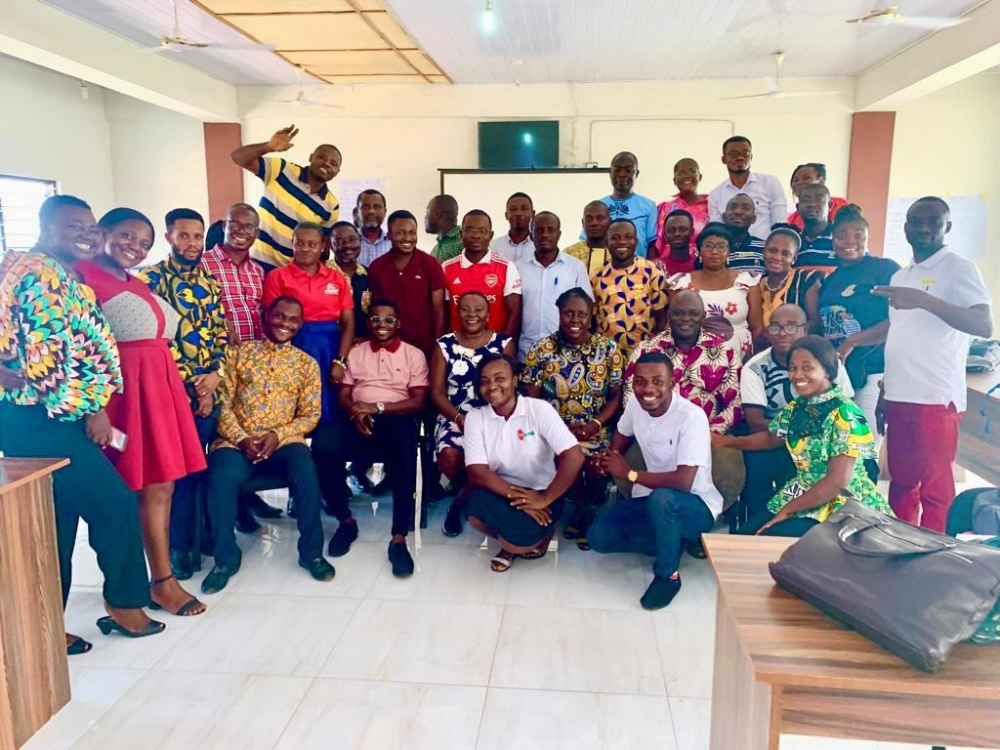

# Gallery

::: {.quote}
*"Your network is your net worth."* -- Porter Gale.
:::

::: {.quote}
Workshops, summits, presentations, and moments beyond the desk.
:::

::: {.gallery-featured}
::: {.gallery-featured-item}

::: {.gallery-featured-content}
### Wellbeing+ Capstone Project 2026

Served as Technical and Team Lead, building a privacy-compliant Kotlin Multiplatform health app for Nytia Labs. Delivered full authentication, HIPAA audit logging, wearable integration, and CI/CD pipeline.

**Category:** Capstone | **Year:** 2026
:::
:::
:::

::: {.gallery-grid}
::: {.gallery-card}

  
  
▶

::: {.gallery-card-content}
**Milestone**
Graduation Ceremony, 2026
:::
:::

::: {.gallery-card}

::: {.gallery-card-content}
**MPS Informatics**
Graduation Ceremony, 2026
:::
:::

::: {.gallery-card}

::: {.gallery-card-content}
**MPhil Computer Science**
Graduation Ceremony, 2023
:::
:::

::: {.gallery-card}

::: {.gallery-card-content}
**Technical Support**
Decoding Cybersecurity Event, 2025
:::
:::

::: {.gallery-card}

::: {.gallery-card-content}
**Teamwork**
Project Management Presentation, 2025
:::
:::

::: {.gallery-card}

::: {.gallery-card-content}
**Professional Development**
PLC Workshop, 2023
:::
:::
:::

<!-- Image lightbox -->

  &times;
  
  

<!-- Video modal -->

  &#10005;
  

    <video id="vid-local" controls playsinline style="max-width:90vw; max-height:85vh; width:auto; height:auto; display:block; background:#000; border-radius:0.5rem; box-shadow:0 4px 30px rgba(0,0,0,0.5);"></video>
  

