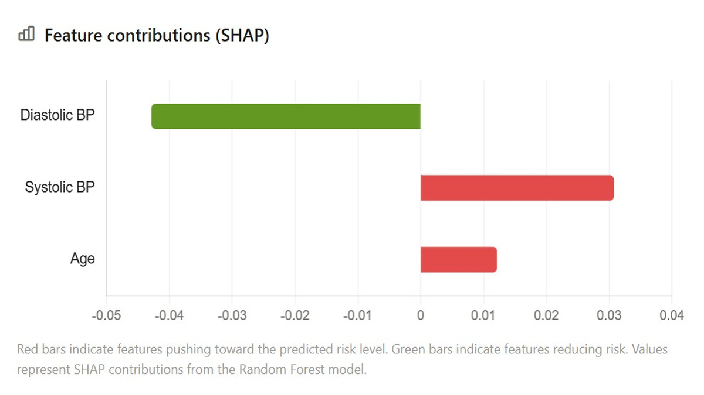
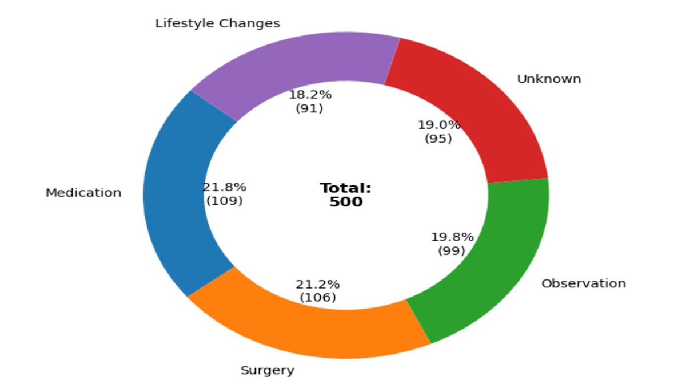
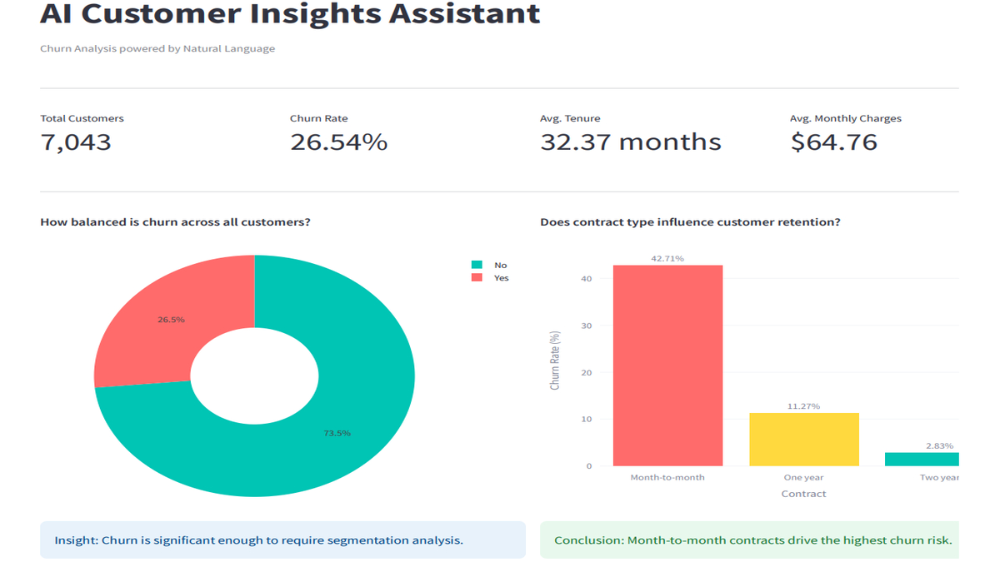

# Featured Projects

::: {.quote}
*"Without data, you're just another person with an opinion."* -- W. Edwards Deming.
:::

::: {.project-cards}

::: {.project-card}

::: {.project-card-content}
### Maternal Health Risk Prediction

End-to-end maternal health risk classification with a FastAPI scoring endpoint, SHAP explainability, Docker containerisation, and CI/CD pipeline integration.

**Tech:** Python, FastAPI, SHAP, Docker, CI/CD, etc.

[GitHub](https://github.com/kduffuor/maternal-health-risk-shap){target="_blank"}
:::
:::

::: {.project-card}

::: {.project-card-content}
### Patient Health Records EDA

Exploratory data analysis of a real-world healthcare dataset using Python and Pandas. Loaded, cleaned, and analysed the data, then built charts to uncover key patterns.

**Tech:** Python, Pandas, Matplotlib, Seaborn, etc.

[GitHub](https://github.com/kduffuor/patient-health-records-eda){target="_blank"}
:::
:::

::: {.project-card}

::: {.project-card-content}
### Fetal Health ML Analysis

Machine learning-based fetal health classification using cardiotocography data. Compares multiple algorithms (XGBoost, Random Forest, MLP, Logistic Regression) for predicting fetal health status with 95.9% accuracy.

**Tech:** Python, Scikit-learn, Pandas, etc.

[GitHub](https://github.com/kduffuor/fetal-health-ml-analysis){target="_blank"}
:::
:::

::: {.project-card}

::: {.project-card-content}
### CardioPredict Deep Learning SHAP

A comprehensive machine learning pipeline for cardiovascular disease prediction using deep neural networks with explainable AI capabilities.

**Tech:** TensorFlow, Scikit-learn, SHAP, etc.

[GitHub](https://github.com/kduffuor/cardiopredict-deep-learning-shap){target="_blank"}
:::
:::

::: {.project-card}

::: {.project-card-content}
### AI Insights Assistant

An AI-powered customer churn analytics dashboard with natural language querying built with Streamlit, Plotly, and HuggingFace LLMs.

**Tech:** Python, Plotly, Pandas, Streamlit, HuggingFace, etc.

[GitHub](https://github.com/kduffuor/ai-insights-assistant){target="_blank"}
:::
:::

::: {.project-card}

::: {.project-card-content}
### Telecom Customer Churn Analytics

Analysing telecom customer churn using Python, SQL, and Power BI. Interactive dashboard and charts showcase insights to reduce churn.

**Tech:** Python, SQL, Power BI, Data Visualisation, etc.

[GitHub](https://github.com/kduffuor/telecom-customer-churn-analytics){target="_blank"}
:::
:::

:::

::: {.text-left}
[View all projects on GitHub](https://github.com/kduffuor?tab=repositories){target="_blank"}
:::